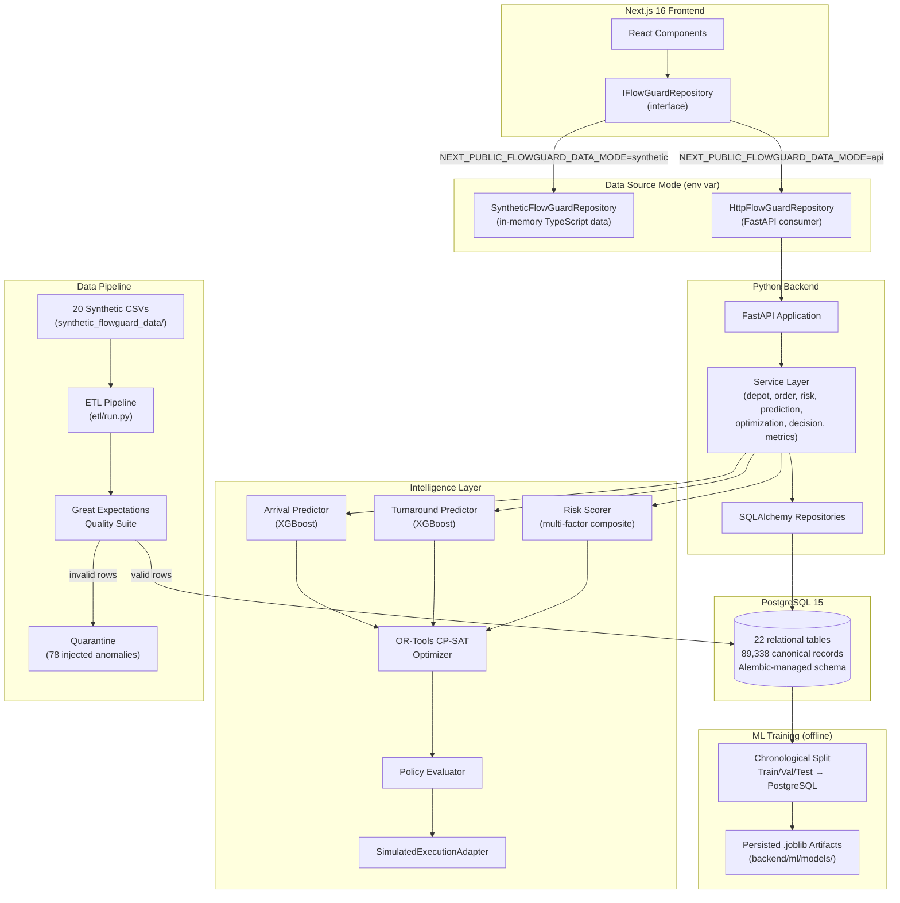

# FlowGuard

> **KPC Petroleum Depot Autonomous Dispatch and Congestion Control System**
> Hackathon 3 — Stage 3 Submission

---

## Table of Contents

1. [Executive Summary](#1-executive-summary)
2. [Problem Being Solved](#2-problem-being-solved)
3. [FlowGuard Solution](#3-flowguard-solution)
4. [Core Operational Loop](#4-core-operational-loop)
5. [Product Experiences](#5-product-experiences)
6. [System Architecture](#6-system-architecture)
7. [Intelligence Architecture](#7-intelligence-architecture)
8. [Data Architecture](#8-data-architecture)
9. [Technology Stack](#9-technology-stack)
10. [Current Implementation Status](#10-current-implementation-status)
11. [Key Capabilities](#11-key-capabilities)
12. [Synthetic Dataset](#12-synthetic-dataset)
13. [Data Quality and ETL](#13-data-quality-and-etl)
14. [PostgreSQL and Performance](#14-postgresql-and-performance)
15. [FastAPI Backend](#15-fastapi-backend)
16. [Machine Learning](#16-machine-learning)
17. [Risk Scoring](#17-risk-scoring)
18. [OR-Tools Optimization](#18-or-tools-optimization)
19. [Bounded Autonomy and Policy](#19-bounded-autonomy-and-policy)
20. [Execution and Verification Boundary](#20-execution-and-verification-boundary)
21. [Frontend Architecture](#21-frontend-architecture)
22. [Backend-Backed Dashboard Integration](#22-backend-backed-dashboard-integration)
23. [CI/CD and Deployment](#23-cicd-and-deployment)
24. [Monitoring and Observability](#24-monitoring-and-observability)
25. [Running Locally](#25-running-locally)
26. [Testing](#26-testing)
27. [Demo Flow](#27-demo-flow)
28. [API Examples](#28-api-examples)
29. [Repository Structure](#29-repository-structure)
30. [Current Limitations](#30-current-limitations)
31. [Hackathon Stage 3 Alignment](#31-hackathon-stage-3-alignment)
32. [Roadmap / Remaining Work](#32-roadmap--remaining-work)
33. [Documentation Index](#33-documentation-index)

---

## 1. Executive Summary

FlowGuard is an operational control plane for Kenya Pipeline Company (KPC) petroleum loading terminals. Its core idea is simple:

> **Don't manage the queue after trucks arrive. Predict the queue before it forms.**

The system connects three capabilities that are typically separate:

- **Predictive intelligence** — XGBoost models forecast tanker arrival times and depot turnaround durations before trucks reach the gate.
- **Constrained optimization** — Google OR-Tools CP-SAT allocates loading positions to active orders, minimising queue wait and turnaround time against hard physical constraints.
- **Bounded autonomy** — a policy layer classifies every recommended action as autonomous, supervised, or blocked, then logs the decision through an 8-stage cryptographically-sealed audit chain.

FlowGuard operates within the KPC terminal boundary:

```
Order registered → Arrival signal → Gate-In → Validation → Staging → Loading → Gate-Out
```

> **Important**: FlowGuard does not control trucks after they leave the depot. It optimises the sequence and assignment of trucks that are already in, or approaching, the terminal.

All operational data in this repository is **synthetic/demo data**. FlowGuard is a demonstration system; it is not connected to live KPC SCADA, gantry controllers, AccuLoad meters, or weighbridge hardware.

---

## 2. Problem Being Solved

KPC depots process hundreds of petroleum uplift orders per day across five terminals: Nairobi (PS10), Mombasa (KOT/PS1), Nakuru (PS25), Eldoret, and Kisumu. Delays accumulate from multiple interacting sources:

- **Arrival clustering** — road tankers scheduled for the same delivery window arrive simultaneously, creating yard queue spikes.
- **Queue pressure** — when more trucks are present than loading positions can absorb, staging wait times inflate.
- **Loading bay capacity** — product incompatibility and equipment faults reduce usable throughput.
- **Product readiness** — bulk storage tank dips and lab certifications can delay uplift if not monitored proactively.
- **Equipment availability** — unresolved pump faults or arm outages reduce effective bay count without central visibility.
- **Validation/process delay** — KRA customs (RECTS), EPRA permit checks, and manifest matching add variable overhead.
- **Operational sequencing** — without queue optimisation, FIFO dispatch under-utilises high-flow dual-arm bays.
- **Turnaround variability** — actual dwell time (Gate-In to Gate-Out) is difficult to forecast without capturing bay concurrency, product type, and tanker configuration simultaneously.

Demurrage exposure accumulates at **KES 20 per minute per stranded tanker**, so a 30-minute delay on six tankers creates KES 3,600 of exposure per hour.

---

## 3. FlowGuard Solution

FlowGuard follows an eight-stage sense-to-audit cycle:

| Stage | Name | What Happens |
|---|---|---|
| 1 | **Sense** | Telemetry signals and operational state are ingested from PostgreSQL. |
| 2 | **Predict** | XGBoost models forecast arrival time and depot turnaround duration per order. |
| 3 | **Diagnose** | Risk scorer synthesises arrival delay, turnaround inflation, and bay concurrency into an explainable 0–100 risk score. |
| 4 | **Optimize** | OR-Tools CP-SAT allocates loading positions to eligible orders, enforcing product compatibility, equipment availability, and no-overlap. |
| 5 | **Decide** | Policy engine classifies the top candidate as `AUTO_EXECUTABLE`, `APPROVAL_REQUIRED`, or `BLOCKED_BY_POLICY`. |
| 6 | **Execute** | `SimulatedExecutionAdapter` records the dispatch with `EXECUTION_SIMULATED_NOT_CONNECTED_TO_KPC_SYSTEMS`. |
| 7 | **Verify** | Post-execution turnaround is compared against the counterfactual baseline; recovery attainment is calculated. |
| 8 | **Log** | Decision, stages, action, and verification are sealed with a SHA-256 audit hash and persisted as append-only records. |

---

## 4. Core Operational Loop

```
Arrival Signal (GPS telematics)
         │
         ▼
ML Arrival Predictor (XGBoost)
         │
         ▼
ML Turnaround Predictor (XGBoost) ── Bay Concurrency Query (PostgreSQL)
         │
         ▼
Risk Scorer (0–100, explainable factors)
         │
         ▼
OR-Tools CP-SAT Optimizer
   ├─ Hard constraints: compatibility, availability, no-overlap
   ├─ Soft objective: minimise wait + turnaround + risk-weighted lateness
   └─ Partial scheduling: best feasible subset (not all-or-nothing)
         │
         ▼
PolicyEvaluator
   ├─ AUTO_EXECUTABLE (L2): routine, reversible, within allowlist
   ├─ APPROVAL_REQUIRED (L3): high-impact or critical risk
   └─ BLOCKED_BY_POLICY: infeasible constraint or empty targets
         │
         ▼
SimulatedExecutionAdapter → ExecutionResult (SIMULATED)
         │
         ▼
Verification + 8-Stage Audit Chain (SHA-256 sealed)
```

---

## 5. Product Experiences

FlowGuard ships six user-facing experiences, each served by the Next.js frontend:

| # | Experience | Route | Primary User |
|---|---|---|---|
| 1 | **Network Command Centre** | `/operations/network` | KPC National Control Room Operator |
| 2 | **Depot Operations** | `/depot/live`, `/depot/capacity`, `/depot/forecast` | Depot Terminal Manager |
| 3 | **OMC Collection Visibility** | `/omc/orders`, `/omc/outlook`, `/omc/notifications` | OMC Dispatcher / Logistics Coordinator |
| 4 | **Autonomous Control** | `/engineer/decisions`, `/engineer/health`, `/engineer/history` | FlowGuard Engineer / Autonomy Reviewer |
| 5 | **Executive Control Plane** | `/executive/overview`, `/executive/value`, `/executive/performance` | KPC Executive Leadership |
| 6 | **Driver Mobile** | `/driver` | Road Tanker Driver |

**Network Command Centre** provides a network-wide operational overview: depot pressure matrix, active risk banners, live intervention feed, and aggregate throughput KPIs across all five depots.

**Depot Operations** shows real-time bay occupancy, staging queue depth, equipment health, product readiness, and a 4-hour predictive inflow forecast.

**OMC Collection Visibility** gives OMC dispatchers an order lifecycle board, inbound telematics outlook, SLA compliance tracking, and priority notifications for their fleet.

**Autonomous Control** is the primary technical interface for reviewing optimization decisions. It displays the 8-stage autonomy pipeline inspector, policy verdicts, candidate action details, and the cryptographic audit log — including the primary demo scenario `DEC-0142`.

**Executive Control Plane** presents multi-depot KPI roll-ups, 90-day turnaround trends, autonomy adoption ratio, economic value waterfall, and ROI scenario modelling.

**Driver Mobile** gives drivers their active order card, digital loading pass, compliance status, assigned bay number, and push notifications for autonomous instructions.

---

## 6. System Architecture



**CURRENT**: All components shown above are implemented.

**FUTURE**: Real-time event streaming, production KPC SCADA integration, live deployment pipeline, Prometheus/Grafana monitoring, materialized views for historical aggregations.

---

## 7. Intelligence Architecture

```
PostgreSQL (canonical operational tables)
         │
         ▼  (feature extraction — indexed point queries)
ML Feature Preprocessor (scikit-learn ColumnTransformer)
         │              │
         ▼              ▼
ArrivalPredictor   TurnaroundPredictor
(XGBoost)          (XGBoost)
         │              │
         └──────┬────────┘
                ▼
        GateOutPredictor
        (Arrival + Turnaround synthesis)
                │
                ▼
         RiskScorer (0–100)
         [arrival_delay_factor, turnaround_inflation_factor,
          bay_concurrency_factor, product_risk_factor]
                │
                ▼
     OR-Tools CP-SAT Optimizer
     [assignment BoolVars, interval vars, no-overlap]
                │
                ▼
       PolicyEvaluator (deterministic)
                │
           ┌────┴────┐
           ▼         ▼
   AUTO_EXECUTABLE  APPROVAL_REQUIRED / BLOCKED_BY_POLICY
           │
           ▼
  SimulatedExecutionAdapter
  [EXECUTION_SIMULATED_NOT_CONNECTED_TO_KPC_SYSTEMS]
           │
           ▼
  8-Stage Audit Chain → SHA-256 seal → PostgreSQL
```

---

## 8. Data Architecture

```
synthetic_flowguard_data/           ← 20 source CSV files (97 days, 89,954 raw rows)
         │
         ▼
etl/run.py                          ← Great Expectations (40 checks) + business rules
         │
    ┌────┴────┐
    │         │
[valid]   [quarantined]             ← 78 intentional anomalies caught; 616 rows quarantined
    │         │
    ▼         ▼
PostgreSQL                          ← 89,338 canonical records, 22 tables, Alembic-managed
    │
    ├── Master dimensions (depots, omcs, products, trucks, loading_positions)
    ├── Operational transactions (loading_orders, gate_events, validation_events,
    │   staging_events, loading_events)
    ├── Infrastructure signals (equipment_events, product_readiness_events,
    │   arrival_signals, notifications)
    ├── Autonomy chain (risk_events, decisions, decision_stages,
    │   autonomous_actions, verification_events, audit_events)
    └── Pipeline governance (etl_runs, quarantine_records)
```

The raw CSV layer is preserved for data lineage. The canonical PostgreSQL layer enforces referential integrity, domain check constraints, and indexed query patterns.

---

## 9. Technology Stack

The following technologies are present and used in the repository:

### Frontend
| Technology | Version | Purpose |
|---|---|---|
| Next.js | 16.3.5 | React framework, app router, server components |
| React | 19.2.8 | UI component library |
| TypeScript | ^5 | Type-safe frontend development |
| Tailwind CSS | ^4 | Utility-first styling |
| Lucide React | ^1.46.0 | Icon library |
| clsx / tailwind-merge | ^2.1.1 / ^3.7.0 | Conditional class composition |

### Backend
| Technology | Version | Purpose |
|---|---|---|
| Python | ≥3.8 | Backend runtime |
| FastAPI | ≥0.110.0 | REST API framework |
| Pydantic v2 | ≥2.7.0 | Request/response schema validation |
| pydantic-settings | ≥2.2.0 | Environment-driven configuration |
| SQLAlchemy | ≥2.0.0 | ORM and repository pattern |
| Alembic | ≥1.13.0 | Database schema migrations |
| psycopg2-binary | ≥2.9.9 | PostgreSQL driver |
| python-dotenv | ≥1.0.1 | `.env` file loading |
| uvicorn | (via fastapi) | ASGI server |

### Data
| Technology | Version | Purpose |
|---|---|---|
| PostgreSQL | 15 | Canonical operational database |
| Pandas | ≥2.0.0 | ETL data manipulation |
| NumPy | ≥1.24.0 | Numerical operations |
| Great Expectations | ≥0.18.0 | Data quality validation suite |

### Machine Learning
| Technology | Version | Purpose |
|---|---|---|
| scikit-learn | ≥1.3.0 | Feature preprocessing pipelines |
| XGBoost | ≥2.0.0 | Gradient-boosted regression models |
| Joblib | ≥1.3.0 | Model artifact serialisation / caching |

### Optimization
| Technology | Version | Purpose |
|---|---|---|
| Google OR-Tools | ≥9.10.0 | CP-SAT constraint programming solver |

### Infrastructure
| Technology | Purpose |
|---|---|
| Docker Compose | Local PostgreSQL 15 instance |

**Not present**: GitHub Actions CI/CD pipelines, Dockerfiles for application services, Prometheus/Grafana monitoring, live deployment configuration (Render or other). These are planned but not implemented.

---

## 10. Current Implementation Status

| Capability | Status | Evidence |
|---|---|---|
| Synthetic source dataset (20 tables, ~90k records) | Complete | `synthetic_flowguard_data/*.csv` |
| Dataset generator (deterministic, seeded) | Complete | `synthetic_flowguard_data/generate_dataset.py` |
| Dataset validator (FK integrity, temporal checks) | Complete | `synthetic_flowguard_data/validate_dataset.py` |
| Great Expectations quality suite (40 expectations) | Complete | `data_quality/` |
| ETL pipeline with quarantine (78 anomalies caught) | Complete | `etl/run.py` |
| Alembic migrations (22-table canonical schema) | Complete | `migrations/versions/` |
| PostgreSQL indexed schema | Complete | `backend/DATABASE_DESIGN.md` |
| SQLAlchemy repositories | Complete | `backend/app/repositories/` |
| FastAPI application | Complete | `backend/app/main.py` |
| Health / readiness probes | Complete | `GET /health`, `GET /ready` |
| Depot API group | Complete | `GET /api/depots`, `/api/depots/{id}/live`, `/api/depots/{id}/forecast` |
| Orders API group | Complete | `GET /api/orders/{id}`, `GET /api/omcs/{id}/orders` |
| Risk API group | Complete | `GET /api/risks/active` |
| Decisions API group | Complete | `GET /api/decisions`, `GET /api/decisions/{id}/trace` |
| Metrics API group | Complete | `GET /api/metrics/network`, `GET /api/metrics/executive` |
| Predictions API group | Complete | `GET /api/predictions/orders/{id}/arrival`, `/turnaround`, `/gate-out`, `/risk` |
| Optimization API group | Complete | `POST /api/optimization/depot/{id}/solve` |
| Arrival prediction (XGBoost) | Complete | `backend/ml/inference/arrival_predictor.py` |
| Turnaround prediction (XGBoost) | Complete | `backend/ml/inference/turnaround_predictor.py` |
| Gate-out synthesis | Complete | `backend/ml/inference/gate_out_predictor.py` |
| Risk scoring (0–100, multi-factor) | Complete | `backend/ml/inference/risk_scorer.py` |
| In-process model caching (singleton) | Complete | `backend/ml/inference/loader.py` |
| OR-Tools CP-SAT optimizer | Complete | `backend/optimization/solver.py` |
| Partial scheduling (no-all-or-nothing) | Complete | `OPTIMIZATION_MODEL.md` |
| Policy evaluator (L2/L3/blocked) | Complete | `backend/policy/evaluator.py` |
| Simulated execution adapter | Complete | `backend/execution/adapter.py` |
| 8-stage decision audit chain | Complete | `backend/app/services/optimization_service.py` |
| HttpFlowGuardRepository (frontend) | Complete | `src/services/httpFlowGuardRepository.ts` |
| SyntheticFlowGuardRepository (frontend) | Complete | `src/services/syntheticDepotData.ts` etc. |
| IFlowGuardRepository abstraction | Complete | `src/services/flowguardService.ts` |
| DataSourceContext (API/synthetic mode switch) | Complete | `src/context/DataSourceContext.tsx` |
| Six dashboard experiences | Complete | `src/app/` |
| Backend-backed network KPIs | Complete | `GET /api/metrics/network` → `HttpFlowGuardRepository` |
| Backend-backed depot live state | Complete | `GET /api/depots/{id}/live` |
| Backend-backed OMC orders | Complete | `GET /api/omcs/{id}/orders` |
| Backend-backed decisions trace | Complete | `GET /api/decisions/{id}/trace` |
| Remaining dashboard widgets in API mode | Partial — many widgets fall back to synthetic TypeScript data in API mode; backend endpoints exist but full dashboard wiring is in progress |
| Realtime event streaming | Not implemented — planned |
| GitHub Actions CI pipeline | Not implemented — no `.github/` directory |
| Application Dockerfiles | Not implemented — only PostgreSQL service in `docker-compose.yml` |
| Live public deployment | Not implemented |
| Prometheus / Grafana monitoring | Not implemented |
| Materialized views | Planned — noted in `DATABASE_DESIGN.md` |

---

## 11. Key Capabilities

- **89,338 canonical records** across 22 PostgreSQL tables derived from 89,954 raw source rows; 616 rows quarantined (78 intentional anomalies caught).
- **97 days of synthetic operational history** (2026-06-11 to 2026-09-15), covering 11,031 loading orders across 5 depots, 7 OMCs, 750 trucks.
- **Two XGBoost prediction models**, trained on strict chronological splits with leakage controls. Turnaround model achieves MAE of 10.33 min vs baseline 22.98 min on synthetic holdout data.
- **OR-Tools CP-SAT optimizer** with product compatibility, equipment availability, and no-overlap constraints; partial scheduling; 5-second timeout; sub-200ms total API round-trip.
- **Three-state policy layer** classifying every recommendation before any dispatch occurs.
- **8-stage audit chain** with SHA-256 cryptographic seal, append-only records, and full trace retrieval via API.
- **Bounded pagination** on all collection endpoints (default 50, maximum 200 records).
- **Structured error envelopes** — no raw SQL or internal paths exposed in error responses.
- **Correlation ID middleware** — every request receives an `X-Request-ID` header for log correlation.
- **In-process model caching** — zero disk I/O per prediction request after first load; ~15 MB total RSS.
- **94 automated tests** across 14 test files covering dataset schema, ETL, data quality, database models, API endpoints, ML pipeline, optimization, and repository queries.

---

## 12. Synthetic Dataset

> **All operational data in this repository is synthetic/demo data.** It does not represent real KPC operational records.

### Why Synthetic Data

The dataset is designed to mimic real-world KPC terminal operations — including realistic Kenyan truck registrations, EPRA permit numbers, product volumes, and pipeline flow rates — without using confidential commercial or operational information.

### Key Metrics

| Metric | Value |
|---|---|
| Source files | 20 CSV files |
| Historical horizon | 97 days (2026-06-11 to 2026-09-15) |
| Total loading orders | 11,031 |
| Total gate events | 32,078 |
| Depots | 5 |
| OMCs | 7 |
| Products | 4 (PMS, AGO, DPK, JET-A1) |
| Fleet size | 750 certified tankers |
| Autonomous decisions | 252 evaluated; 173 executed |
| Decision stages | 2,016 discrete records |
| Intentional anomalies | 78 (all quarantined by ETL) |

### Deterministic Generation

The dataset is reproducible with a fixed master seed (`20260915`):

```bash
python3 synthetic_flowguard_data/generate_dataset.py
```

Integrity validation:

```bash
python3 synthetic_flowguard_data/validate_dataset.py
```

### Operational Scenarios Embedded

The dataset contains four engineered stress scenarios:
1. **Mombasa Coastal Heavy Rains** (Week 6) — arrival clustering from weather.
2. **Nakuru Depot Bay 2 Pump Outage** (Week 9) — equipment fault causing rerouting.
3. **Eldoret AGO Stockout Risk** — pipeline batch receipt lag and proactive rate-limiting.
4. **Primary Nairobi Demo Scenario** (2026-09-15) — order `LO-NBO-8821`, decision `DEC-0142`, action `ACT-8801`, verification `VER-8801` (-34 min turnaround reduction, 89.5% recovery attainment).

### Supporting Documentation

- [`synthetic_flowguard_data/SYNTHETIC_DATASET_README.md`](synthetic_flowguard_data/SYNTHETIC_DATASET_README.md)
- [`synthetic_flowguard_data/DATA_DICTIONARY.md`](synthetic_flowguard_data/DATA_DICTIONARY.md)
- [`synthetic_flowguard_data/DASHBOARD_DATA_MAPPING.md`](synthetic_flowguard_data/DASHBOARD_DATA_MAPPING.md)
- [`synthetic_flowguard_data/DATA_QUALITY_REPORT.md`](synthetic_flowguard_data/DATA_QUALITY_REPORT.md)
- [`synthetic_flowguard_data/INTENTIONAL_ANOMALIES.json`](synthetic_flowguard_data/INTENTIONAL_ANOMALIES.json)
- [`synthetic_flowguard_data/MANIFEST.json`](synthetic_flowguard_data/MANIFEST.json)

---

## 13. Data Quality and ETL

The ETL pipeline (`etl/run.py`) is idempotent and runs in a single command:

```bash
python3 -m etl.run
```

### Pipeline Stages

```
Source CSVs
    │
    ▼  Stage 1: File & Schema Discovery
    │  (verifies all 20 CSVs exist; reads into DataFrames)
    │
    ▼  Stage 2: Great Expectations Quality Gate (40 expectations)
    │  Column count, primary key uniqueness, depot/product set containment,
    │  quantity ranges, duration non-negativity
    │  → Output: data_quality/reports/great_expectations_report.json
    │
    ▼  Stage 3: Business Rule Validation & Quarantine
    │  Checks: duplicate PKs, unknown FK references, negative quantities,
    │  volumes exceeding 100,000L axle limit, chronological inversions,
    │  orphaned child records
    │  → Invalid rows → etl/quarantine/*_quarantined.csv + quarantine_records table
    │
    ▼  Stage 4: Cleaning & Type Normalisation
    │  Whitespace trimming, ISO 8601 datetime parsing, NaN → NULL, boolean casts
    │
    ▼  Stage 5: Idempotent Database Ingestion
    │  TRUNCATE in reverse dependency order → bulk insert forward
    │  (single ACID transaction; zero duplicate records on re-run)
    │
    ▼  Stage 6: ETL Run Audit
       Logs run_id, start/end time, rows_read, rows_loaded,
       rows_quarantined, and status to etl_runs table
```

### Standalone Quality Check

To run Great Expectations validation without modifying the database:

```bash
python3 -m data_quality.checkpoints.run_quality_gate
```

### Quarantine Records

Each quarantined row captures: source table, source row ID, triggered rule (e.g. `RULE_NEGATIVE_QUANTITY`, `RULE_CHRONOLOGICAL_INVERSION`), human-readable failure reason, and the full original JSON record. Records are written to both CSV and the `quarantine_records` table linked to `etl_run_id`.

### ETL Run Results (Actual from Loaded Database)

| Metric | Value |
|---|---|
| Rows read | 89,954 |
| Rows loaded | 89,338 |
| Rows quarantined | 616 |
| Status | SUCCESS |

---

## 14. PostgreSQL and Performance

### Schema

22 relational tables managed by a single Alembic migration (`migrations/versions/144f9fbd2d79_initial_canonical_schema.py`):
- 5 master dimension tables
- 10 operational transaction and milestone tables
- 4 autonomy/control/audit tables
- 2 pipeline governance tables (`etl_runs`, `quarantine_records`)

### Indexing

Critical operational query patterns were benchmarked with `EXPLAIN ANALYZE` and indexed where beneficial:

| Index | Type | Measured Execution Time |
|---|---|---|
| `ix_orders_active_depot` | Partial on active orders only | 0.065 ms |
| `ix_active_risks_partial` | Partial on `status='ACTIVE'` | 0.055 ms |
| `ix_decision_stages_decision_seq` | Composite `(decision_id, stage_sequence)` | 0.045 ms |
| `ix_orders_omc_status` | Composite `(omc_id, order_status)` | 3.8 ms (2,733 rows) |
| `ix_gate_events_order_time` | Composite `(order_id, event_timestamp)` | 0.134 ms |

Not all queries are index-only; some analytical queries (e.g. `GET /api/metrics/network`) perform SQL aggregations across the full dataset and take ~45–250 ms.

### Pagination

All collection endpoints enforce server-side pagination:
- Default limit: 50 records
- Maximum limit: 200 records (HTTP 422 if exceeded)
- Responses include a standard `pagination` envelope with `total`, `has_more`, `limit`, and `offset`.

See [`backend/DATABASE_DESIGN.md`](backend/DATABASE_DESIGN.md) and [`backend/PERFORMANCE_NOTES.md`](backend/PERFORMANCE_NOTES.md) for full EXPLAIN ANALYZE traces.

---

## 15. FastAPI Backend

### Application Structure

```
backend/app/
├── main.py           ← FastAPI app, middleware, exception handlers
├── config.py         ← pydantic-settings configuration
├── api/
│   ├── deps.py       ← Dependency injection (DB session, services)
│   └── routes/       ← Route handlers per domain
│       ├── health.py
│       ├── depots.py
│       ├── orders.py
│       ├── risks.py
│       ├── decisions.py
│       ├── metrics.py
│       ├── predictions.py
│       └── optimization.py
├── db/               ← SQLAlchemy session and engine
├── repositories/     ← Data access layer
├── schemas/          ← Pydantic request/response models
└── services/         ← Business logic layer
```

### API Groups and Endpoints

| Group | Endpoint | Description |
|---|---|---|
| **Health** | `GET /health` | Liveness probe |
| | `GET /ready` | Readiness probe (database connectivity) |
| **Depots** | `GET /api/depots` | All 5 KPC depots |
| | `GET /api/depots/{depot_id}/live` | Live bay occupancy, queue depth, positions |
| | `GET /api/depots/{depot_id}/forecast` | 4-hour predictive inflow |
| **Orders** | `GET /api/orders/{order_id}` | Full lifecycle trail with milestones |
| | `GET /api/omcs/{omc_id}/orders` | Paginated OMC order board |
| | `GET /api/omcs/{omc_id}/summary` | OMC order status counts |
| **Risks** | `GET /api/risks/active` | Active congestion and demurrage risks |
| **Decisions** | `GET /api/decisions` | Paginated autonomous decisions |
| | `GET /api/decisions/{decision_id}/trace` | Full 8-stage trace + SHA-256 audit |
| **Metrics** | `GET /api/metrics/network` | Network Command Centre KPIs |
| | `GET /api/metrics/executive` | Executive Control Plane KPIs |
| **Predictions** | `GET /api/predictions/orders/{id}/arrival` | ML arrival prediction |
| | `GET /api/predictions/orders/{id}/turnaround` | ML turnaround prediction |
| | `GET /api/predictions/orders/{id}/gate-out` | Predicted Gate-Out synthesis |
| | `GET /api/predictions/orders/{id}/risk` | Order risk score (0–100) |
| | `GET /api/predictions/depots/{id}/risk` | Aggregated depot risk profile |
| **Optimization** | `POST /api/optimization/depot/{depot_id}/solve` | Run CP-SAT optimizer |
| | `GET /api/optimization/decisions/{decision_id}` | Get persisted decision |
| | `GET /api/optimization/decisions/{decision_id}/candidates` | Candidate alternatives |
| | `POST /api/optimization/decisions/{decision_id}/approve` | Simulate supervisor approval |
| | `GET /api/optimization/depot/{depot_id}/recommendations` | Latest recommendation |

**Swagger UI**: `http://localhost:8000/docs`
**OpenAPI JSON**: `http://localhost:8000/openapi.json`

### Middleware

- **CORS** — configured for `localhost:3000` and `localhost:8000` in development.
- **Request Logging** — structured log per request with correlation ID (`X-Request-ID`), response time (`X-Response-Time`), method, path, and status code.
- **Exception Handlers** — `FlowGuardServiceException`, `HTTPException`, `RequestValidationError`, and unhandled exceptions all return the standardised error envelope without leaking SQL or internal paths.

---

## 16. Machine Learning

> **Important**: All ML metrics reported below are **synthetic evaluation results** measured against the synthetically generated dataset. They do not represent live KPC operational performance.

### Models

Two XGBoost regression models are trained, persisted as `.joblib` artifacts, and loaded via an in-process singleton cache:

#### Model 1: Tanker Arrival Predictor

Predicts estimated time until a tanker reaches the depot gate.

- **Target**: minutes to gate arrival
- **Features**: order registration data, depot identity, OMC identity, product, quantity, telematics distance/confidence, time of day, historical arrival patterns
- **Leakage controls**: no gate event, validation, staging, or loading features included
- **Baseline**: Planned lead time (MAE 11.38 min, RMSE 14.20 min)
- **XGBoost model** (synthetic eval): MAE 10.88 min, RMSE 13.67 min — demonstrated error reduction on holdout test set
- **Artifact**: `backend/ml/models/arrival/arrival_model_v1.joblib`

#### Model 2: Depot Turnaround Predictor

Predicts Gate-In to Gate-Out dwell time (minutes).

- **Target**: turnaround minutes
- **Features**: depot, OMC, product, quantity, gate lane, time of day, day of week, tare weight, active trucks in depot, estimated bay utilisation, dual-arm bay count, compatible bay count
- **Leakage controls**: no post-gate-in inspection durations, actual flow rates, gross weight, or verification/audit data included
- **Baseline**: Static KPC depot target (MAE 22.98 min, RMSE 27.54 min, within 10 min: 23.8%)
- **XGBoost model** (synthetic eval): MAE 10.33 min, RMSE 12.82 min, within 10 min: 55.1% — 55% error reduction
- **Artifact**: `backend/ml/models/turnaround/turnaround_model_v1.joblib`

#### Model 3: Gate-Out Synthesis

Rule-based combination: `Predicted Gate-Out = Predicted Arrival + Predicted Turnaround` (or `Actual Gate-In + Turnaround` once the truck has arrived).

### Chronological Split

| Split | Date Range | Orders | Fraction |
|---|---|---|---|
| Train | 2026-06-11 to 2026-08-10 | 6,479 | 62.3% |
| Validation | 2026-08-11 to 2026-08-31 | 2,260 | 21.7% |
| Test (holdout) | 2026-09-01 to 2026-09-15 | 1,667 | 16.0% |

No temporal shuffle is applied. Models are trained on older data and evaluated on more recent data, reflecting realistic deployment conditions.

### Inference Latency (measured on synthetic database)

| Operation | Measured FastAPI Latency |
|---|---|
| Arrival feature extraction | 1.8 ms |
| Arrival model inference | 34.0 ms |
| Turnaround feature extraction | 18.5 ms |
| Turnaround model inference | 47.4 ms |
| Gate-out synthesis | 1.6 ms |
| Risk scoring | 54.3 ms |

### Training Commands

```bash
python3 -m backend.ml.training.train_arrival
python3 -m backend.ml.training.train_turnaround
```

---

## 17. Risk Scoring

The `RiskScorer` synthesises multiple operational signals into an explainable 0–100 composite score:

| Factor | Signal |
|---|---|
| Arrival delay factor | Predicted arrival vs planned window |
| Turnaround inflation factor | Predicted turnaround vs depot baseline |
| Bay concurrency factor | Active trucks vs total usable positions |
| Product risk factor | Product type (JET-A1 / DPK carry higher handling overhead) |

Risk tiers:
- **LOW** (0–39): normal operations
- **MODERATE** (40–59): monitor closely
- **HIGH** (60–79): proactive intervention recommended
- **CRITICAL** (80–100): autonomous or supervised intervention required

Risk scores are exposed via `GET /api/predictions/orders/{id}/risk` and `GET /api/predictions/depots/{id}/risk`. They feed directly into the OR-Tools objective function as priority weights.

---

## 18. OR-Tools Optimization

### What It Solves

The CP-SAT optimizer answers: *"Given active orders and available loading positions, what is the optimal assignment that minimises total wait, turnaround, and risk-weighted lateness?"*

It operates on a 4-hour (240-minute) near-term horizon with at most 12 eligible orders per depot per solve.

### Decision Variables

- `x[o,p]` — BoolVar: assign order `o` to position `p`
- `scheduled[o]` — BoolVar: order is assigned to a bay (1) or queued (0)
- `start[o]`, `end[o]`, `duration[o]` — IntVars for no-overlap interval modelling

### Hard Constraints

1. Each order assigned to at most one compatible position.
2. No two orders overlap on the same position (`AddNoOverlap`).
3. Start time ≥ predicted arrival.
4. All intervals within 240-minute planning horizon.

### Objective Function

Minimise: `Σ_o [2·wait[o] + 3·turnaround[o] + risk_weight[o]·lateness[o] − 10,000·scheduled[o]]`

The large schedule benefit term (10,000) ensures the solver always prefers assigning an order over leaving it queued when a compatible bay is available. The risk component prioritises higher-risk orders when capacity is constrained.

### Partial Scheduling

If there are more eligible orders than available compatible positions, the solver assigns the highest-priority feasible subset. This is a valid, non-infeasible outcome — not an error condition.

### Solver Performance (synthetic database)

| Depot | Orders | Positions | Total API Round-Trip |
|---|---|---|---|
| Nairobi (PS10) | 3 | 8 | ~100–200 ms |
| Mombasa (KOT) | 2 | 10 | ~80–150 ms |

CP-SAT timeout: 5 seconds. All synthetic scenarios resolve in under 100 ms of solver time.

### Idempotency

Decisions are cached for 15 minutes per depot. Repeat POSTs within the window return the existing decision without re-running the solver. Use `?force_new=true` to bypass.

### Counterfactual Estimates

The optimizer computes FIFO-baseline vs CP-SAT schedule comparisons:
- `turnaround_reduction_min` — difference in average turnaround
- `queue_wait_reduction_min` — difference in average wait
- `total_dwell_minutes_saved` — reduction × scheduled orders

These are **estimates comparing two schedule plans**, not claims of achieved operational impact. They are not the same as verified savings records from the synthetic audit trail.

---

## 19. Bounded Autonomy and Policy

The `PolicyEvaluator` (`backend/policy/evaluator.py`) is a deterministic, stateless rule engine that runs after the optimizer produces a candidate action. It applies the following checks in order:

| Check | Rule | Outcome if triggered |
|---|---|---|
| Constraint status | Must be `FEASIBLE_VERIFIED` | `BLOCKED_BY_POLICY` |
| Empty targets | Must have ≥1 order and ≥1 position | `BLOCKED_BY_POLICY` |
| Restricted action type | Action on the restricted list | `APPROVAL_REQUIRED` |
| Order count | >6 affected orders | `APPROVAL_REQUIRED` |
| Critical risk | Risk score ≥85 or level=CRITICAL | `APPROVAL_REQUIRED` |
| Confidence | Prediction confidence <75% | `APPROVAL_REQUIRED` |
| Action allowlist | Action not on L2 allowlist | `APPROVAL_REQUIRED` |
| All checks pass | — | `AUTO_EXECUTABLE` |

**Policy states and autonomy levels:**

| Policy State | Autonomy Level | Meaning |
|---|---|---|
| `AUTO_EXECUTABLE` | `L2_AUTO_EXECUTABLE` | Routine, reversible; dispatched to simulated adapter |
| `APPROVAL_REQUIRED` | `L3_SUPERVISED_APPROVAL` | Human sign-off required before execution |
| `BLOCKED_BY_POLICY` | `L1_RECOMMENDATION` | Action is not dispatched |

> **Important**: These are FlowGuard demo governance assumptions. They are not verified KPC operating procedures. `APPROVAL_REQUIRED` triggers simulated execution, not connection to any external approval workflow.

Supervisor approval can be simulated via `POST /api/optimization/decisions/{id}/approve`.

---

## 20. Execution and Verification Boundary

> **EXECUTION_SIMULATED_NOT_CONNECTED_TO_KPC_SYSTEMS**

The `SimulatedExecutionAdapter` (`backend/execution/adapter.py`) is the only execution implementation in this repository. Its docstring begins with:

```
CRITICAL SAFETY DIRECTIVE:
This adapter explicitly operates in SIMULATED mode. It DOES NOT connect to,
actuate, or transmit electrical signals to any real KPC SCADA, PLC, gantry
flow meter, or weighbridge system.
```

Every `ExecutionResult` carries:
- `control_state: "SIMULATED"` (or `"REJECTED_BY_POLICY"`)
- `execution_result: "EXECUTION_SIMULATED_NOT_CONNECTED_TO_KPC_SYSTEMS"`
- `is_simulation: true`
- `safety_disclaimer: "SIMULATED_EXECUTION: Explicitly not connected to live KPC physical gantry or SCADA systems."`

This repository does not contain any SCADA driver, Modbus/OPC-UA adapter, MQTT broker connection, gantry PLC interface, AccuLoad meter integration, or weighbridge API client. FlowGuard does not actuate physical equipment.

---

## 21. Frontend Architecture

### Data Source Abstraction

The frontend uses a repository interface (`IFlowGuardRepository` in `src/services/flowguardService.ts`) with two concrete implementations:

```
IFlowGuardRepository
        │
        ├── SyntheticFlowGuardRepository (default)
        │   └── In-memory TypeScript data
        │       ├── syntheticDepotData.ts
        │       ├── syntheticOmcData.ts
        │       ├── syntheticAutonomyData.ts
        │       └── syntheticExecutiveData.ts
        │
        └── HttpFlowGuardRepository (API mode)
            └── Fetches from FastAPI + PostgreSQL
                Defined in: src/services/httpFlowGuardRepository.ts
```

### Switching Modes

Set `NEXT_PUBLIC_FLOWGUARD_DATA_MODE` in your environment:

| Mode | Value | Data Source |
|---|---|---|
| Default (synthetic) | `synthetic` | In-memory TypeScript datasets |
| API mode | `api` | FastAPI backend → PostgreSQL |

The `DataSourceContext` (`src/context/DataSourceContext.tsx`) manages connection state in API mode, including 60-second periodic health checks and manual retry. It does **not** silently fall back to synthetic data — API failures are surfaced explicitly in the UI.

### App Router Structure (Next.js 16)

```
src/app/
├── operations/network/         ← Network Command Centre
├── depot/live|capacity|forecast← Depot Operations
├── omc/orders|outlook|notifications ← OMC Visibility
├── engineer/decisions|health|history ← Autonomous Control
├── executive/overview|value|performance ← Executive Plane
└── driver/                     ← Driver Mobile
```

---

## 22. Backend-Backed Dashboard Integration

The `HttpFlowGuardRepository` connects to the FastAPI backend for these data domains:

| Dashboard Domain | Backend Endpoint | Status |
|---|---|---|
| Network KPIs (throughput, orders, savings) | `GET /api/metrics/network` | Backend-backed |
| Executive KPIs and autonomy ratio | `GET /api/metrics/executive` | Backend-backed |
| Depot live state (bay occupancy, queue) | `GET /api/depots/{id}/live` | Backend-backed |
| Depot forecast (4-hour inflow) | `GET /api/depots/{id}/forecast` | Backend-backed |
| OMC order board (paginated) | `GET /api/omcs/{id}/orders` | Backend-backed |
| OMC order status summary | `GET /api/omcs/{id}/summary` | Backend-backed |
| Decision trace (8-stage) | `GET /api/decisions/{id}/trace` | Backend-backed |
| Active risks | `GET /api/risks/active` | Backend-backed |
| ML predictions (arrival, turnaround, risk) | `GET /api/predictions/…` | Backend-backed |
| Optimization solve and approve | `POST /api/optimization/…` | Backend-backed |

**Remaining in synthetic TypeScript data in API mode**: many individual dashboard widget data points (yard truck cards, capacity state grids, equipment drawers, OMC profile details, autonomy subsystem health metrics, executive turnaround trend charts, ROI waterfall breakdowns) are initialised from the synthetic TypeScript modules in `HttpFlowGuardRepository`'s constructor. Completing the full backend data wiring for every widget is the primary remaining integration task.

There is no silent fallback to synthetic data in API mode. Widgets that cannot reach the backend surface an explicit connection error state.

---

## 23. CI/CD and Deployment

### Current State

- **No `.github/` directory exists** — GitHub Actions workflows have not been implemented.
- **No application Dockerfiles** — the `docker-compose.yml` defines only the PostgreSQL service.
- **No live public deployment** — FlowGuard is a local development system.

### What Exists

| Asset | Status |
|---|---|
| `docker-compose.yml` (PostgreSQL 15) | Present — used for local database |
| `pyproject.toml` (Python package metadata) | Present |
| `alembic.ini` (migration configuration) | Present |
| `.env.example` (environment template) | Present |

### What Remains

To complete a CI/CD pipeline:
1. Application `Dockerfile` for the FastAPI backend
2. Application `Dockerfile` (or build step) for the Next.js frontend
3. GitHub Actions workflow: lint → test → build → push image
4. Deployment target configuration (Render, Railway, or similar)
5. Environment variable injection in CI/CD

---

## 24. Monitoring and Observability

### Currently Implemented

| Capability | Implementation |
|---|---|
| **Liveness probe** | `GET /health` → `{"status": "ok", "version": "1.0.0", "environment": "development"}` |
| **Readiness probe** | `GET /ready` → verifies live `SELECT 1;` against PostgreSQL; returns HTTP 503 if database is down |
| **Structured request logging** | Per-request log lines with correlation ID, method, path, status, duration |
| **Correlation ID header** | `X-Request-ID` propagated on every response |
| **Response time header** | `X-Response-Time` on every response |
| **Centralised exception handling** | All error types produce structured JSON envelopes; no stack traces in responses |

### Not Implemented

- Prometheus metrics endpoint (`/metrics`)
- Grafana dashboards
- Application performance monitoring (APM)
- Alerting / on-call integration
- Distributed tracing

---

## 25. Running Locally

### Prerequisites

- Python 3.8+
- Node.js 18+
- Docker and Docker Compose (for PostgreSQL)

### Step 1 — Clone and Configure

```bash
git clone <repository-url>
cd hackathon3
cp .env.example .env
```

Default `.env` values work out of the box with the Docker Compose PostgreSQL instance.

### Step 2 — Install Python Dependencies

```bash
pip install -r requirements.txt
# or install as editable package
pip install -e .
```

### Step 3 — Start PostgreSQL

```bash
docker compose up -d postgres
```

Wait for the healthcheck to pass (the container logs `database system is ready to accept connections`).

### Step 4 — Apply Database Migrations

```bash
alembic upgrade head
```

### Step 5 — Run ETL Pipeline

```bash
python3 -m etl.run
```

This loads all 89,338 records into PostgreSQL. Expect ~30–60 seconds on first run.

### Step 6 — (Optional) Train ML Models

Pre-trained `.joblib` artifacts are committed to the repository. Re-train if needed:

```bash
python3 -m backend.ml.training.train_arrival
python3 -m backend.ml.training.train_turnaround
```

### Step 7 — Start FastAPI Backend

```bash
uvicorn backend.app.main:app --reload --host 0.0.0.0 --port 8000
```

Verify: `curl http://localhost:8000/health`

### Step 8 — Install Frontend Dependencies

```bash
npm install
```

### Step 9 — Start Next.js Frontend

**Synthetic mode (no backend required):**

```bash
npm run dev
```

**API mode (connects to FastAPI):**

```bash
NEXT_PUBLIC_FLOWGUARD_DATA_MODE=api \
NEXT_PUBLIC_FLOWGUARD_API_URL=http://localhost:8000 \
npm run dev
```

Open `http://localhost:3000`.

---

## 26. Testing

### Test Suite

14 test files, 94 test functions across the following domains:

| File | Tests | Coverage |
|---|---|---|
| `test_optimization.py` | 35 | OR-Tools solver, policy, constraints, edge cases |
| `test_ml_pipeline.py` | 11 | Feature extraction, training, inference, risk scoring |
| `test_api_predictions.py` | 7 | Prediction endpoint contracts |
| `test_repository_queries.py` | 6 | Repository pagination, lifecycle traces |
| `test_database_models.py` | 5 | SQLAlchemy model constraints and indexes |
| `test_dataset_schema.py` | 5 | CSV manifest, column schema, FK integrity |
| `test_api_decisions.py` | 4 | Decision trace API |
| `test_api_depots.py` | 4 | Depot live and forecast API |
| `test_api_orders.py` | 5 | Order lifecycle API |
| `test_api_metrics.py` | 3 | Network and executive metrics API |
| `test_api_health.py` | 2 | Liveness and readiness probes |
| `test_api_risks.py` | 2 | Active risk API |
| `test_data_quality.py` | 2 | Great Expectations anomaly detection |
| `test_etl.py` | 3 | ETL idempotency and audit tracking |

### Running Tests

```bash
# Full test suite (requires seeded PostgreSQL)
python3 -m pytest tests/ -v

# Optimization tests only (no database required)
python3 -m pytest tests/test_optimization.py -v

# Exclude integration tests (no database required)
python3 -m pytest tests/ -m "not integration" -v

# With coverage report
python3 -m pytest tests/ --cov=backend -v
```

> **Note**: The test suite requires Python dependencies installed (`pip install -r requirements.txt`). Integration tests (`-m integration`) additionally require a seeded PostgreSQL database.

### Frontend Build Check

```bash
npm run build
```

This validates the Next.js application compiles without TypeScript or build errors.

---

## 27. Demo Flow

The following walkthrough is designed for hackathon judges. Start with the frontend running in synthetic mode (`npm run dev`) to ensure all data is immediately visible without a backend requirement.

**For full backend integration, run in API mode** (follow [Section 25](#25-running-locally) first).

1. **Open the Network Command Centre** at `http://localhost:3000/operations/network`. Observe the five-depot pressure matrix, the KPI strip (throughput, average turnaround, demurrage exposure), and the live intervention feed.

2. **Observe the Nairobi depot** showing `CAPACITY PRESSURE` / `CRITICAL` risk state. This is the primary demo scenario.

3. **Open Depot Operations** for Nairobi (`/depot/live`). Note the bay grid, active loading positions, staging queue depth, and the 4-hour predictive inflow forecast.

4. **Navigate to Autonomous Control** (`/engineer/decisions`). Select decision `DEC-0142`.

5. **Walk through the 8-stage pipeline inspector**:
   - Stage 1 (SIGNAL): Arrival telemetry ingested; 18 expected vs 11 capacity.
   - Stage 2 (PREDICT): XGBoost models predict congestion-inflated turnaround.
   - Stage 3 (DIAGNOSE): Risk score triggered at critical level.
   - Stage 4 (OPTIMIZE): OR-Tools CP-SAT allocates bays, selects action `OPT-03`.
   - Stage 5 (DECIDE): Policy evaluates and classifies as `AUTO_EXECUTABLE`.
   - Stage 6 (EXECUTE): Simulated dispatch to Gantry Loading Gateway (SIMULATED).
   - Stage 7 (VERIFY): Post-execution measurement: -34 min reduction, 89.5% recovery attainment.
   - Stage 8 (LOG): SHA-256 cryptographic audit seal `AUD-8801`.

6. **Show the policy verdict** — `L2_AUTO_EXECUTABLE`. Note the policy reasons explaining why human approval was not required.

7. **Show the execution boundary** — `execution_result: "EXECUTION_SIMULATED_NOT_CONNECTED_TO_KPC_SYSTEMS"`. Emphasise this is a demo system.

8. **Open the Executive Control Plane** (`/executive/overview`). Show the autonomy adoption ratio (~60%), cumulative realized savings (KES 43M+), and 90-day turnaround trend.

9. **Optional — run a live optimization** (API mode only):
   ```bash
   curl -X POST 'http://localhost:8000/api/optimization/depot/nairobi/solve' \
     | python3 -m json.tool
   ```

---

## 28. API Examples

### Liveness Probe

```bash
curl http://localhost:8000/health
```

```json
{"status": "ok", "version": "1.0.0", "environment": "development"}
```

### Readiness Probe (database connectivity)

```bash
curl http://localhost:8000/ready
```

```json
{"status": "ready", "database": "ok", "version": "1.0.0"}
```

### Network KPIs

```bash
curl http://localhost:8000/api/metrics/network
```

### Depot Live State (Nairobi)

```bash
curl http://localhost:8000/api/depots/nairobi/live
```

### Full Order Lifecycle

```bash
curl http://localhost:8000/api/orders/LO-NBO-8821
```

### Turnaround Prediction

```bash
curl http://localhost:8000/api/predictions/orders/LO-NBO-8821/turnaround
```

### Decision Trace (8-stage audit)

```bash
curl http://localhost:8000/api/decisions/DEC-0142/trace
```

### Run OR-Tools Optimization

```bash
curl -X POST 'http://localhost:8000/api/optimization/depot/nairobi/solve' \
  | python3 -m json.tool
```

### Force Fresh Optimization (bypass 15-min cache)

```bash
curl -X POST 'http://localhost:8000/api/optimization/depot/nairobi/solve?force_new=true' \
  | python3 -m json.tool
```

---

## 29. Repository Structure

```
hackathon3/
├── .env.example                        ← Environment variable template
├── docker-compose.yml                  ← PostgreSQL 15 service
├── pyproject.toml                      ← Python package metadata
├── requirements.txt                    ← Python dependencies
├── alembic.ini                         ← Alembic migration config
├── package.json                        ← Node.js dependencies (Next.js 16)
│
├── synthetic_flowguard_data/           ← 20 source CSV files + documentation
│   ├── 01_depots.csv … 20_audit_events.csv
│   ├── generate_dataset.py             ← Deterministic dataset generator
│   ├── validate_dataset.py             ← FK/temporal integrity validator
│   ├── SYNTHETIC_DATASET_README.md
│   ├── DATA_DICTIONARY.md
│   ├── DASHBOARD_DATA_MAPPING.md
│   ├── DATA_QUALITY_REPORT.md
│   ├── INTENTIONAL_ANOMALIES.json
│   └── MANIFEST.json
│
├── migrations/                         ← Alembic migration scripts
│   └── versions/
│       └── 144f9fbd2d79_initial_canonical_schema.py
│
├── etl/                                ← ETL pipeline
│   ├── run.py                          ← Main ETL entry point
│   ├── validators/                     ← Business rule validators
│   ├── transformers/                   ← Data cleaning / normalisation
│   ├── loaders/                        ← PostgreSQL bulk loaders
│   ├── quarantine/                     ← Quarantined row output
│   └── README.md
│
├── data_quality/                       ← Great Expectations configuration
│   ├── expectations/
│   ├── checkpoints/
│   └── reports/
│
├── backend/
│   ├── README.md                       ← Backend setup guide
│   ├── API_CONTRACT.md                 ← API contract specification
│   ├── API_PERFORMANCE.md              ← Endpoint performance benchmarks
│   ├── DATABASE_DESIGN.md              ← Relational schema documentation
│   ├── PERFORMANCE_NOTES.md            ← EXPLAIN ANALYZE traces
│   │
│   ├── app/                            ← FastAPI application
│   │   ├── main.py                     ← App factory, middleware, exception handlers
│   │   ├── config.py                   ← pydantic-settings configuration
│   │   ├── api/routes/                 ← Route handlers
│   │   ├── db/                         ← SQLAlchemy session
│   │   ├── repositories/               ← Data access layer
│   │   ├── schemas/                    ← Pydantic models
│   │   └── services/                   ← Business logic
│   │
│   ├── ml/                             ← Machine learning layer
│   │   ├── README.md
│   │   ├── FEATURE_DEFINITIONS.md
│   │   ├── MODEL_CARD_ARRIVAL.md
│   │   ├── MODEL_CARD_TURNAROUND.md
│   │   ├── ML_PERFORMANCE.md
│   │   ├── datasets/                   ← SQL feature extractors
│   │   ├── features/                   ← Preprocessing and leakage validators
│   │   ├── models/                     ← Persisted .joblib artifacts + metadata
│   │   ├── training/                   ← Training scripts
│   │   ├── evaluation/                 ← Metrics computation
│   │   └── inference/                  ← Online prediction services
│   │
│   ├── optimization/                   ← OR-Tools CP-SAT optimizer
│   │   ├── README.md
│   │   ├── OPTIMIZATION_MODEL.md
│   │   ├── OPTIMIZATION_PERFORMANCE.md
│   │   ├── solver.py
│   │   └── models.py
│   │
│   ├── policy/                         ← Policy / bounded autonomy
│   │   ├── README.md
│   │   ├── evaluator.py
│   │   └── policy_config.py
│   │
│   └── execution/                      ← Simulated execution adapter
│       └── adapter.py
│
├── tests/                              ← 14 test files, 94 test functions
│   ├── conftest.py
│   ├── test_optimization.py            ← 35 tests (largest file)
│   └── … (13 additional test files)
│
└── src/                                ← Next.js frontend
    ├── app/                            ← App router pages (25 routes)
    ├── components/                     ← React components
    ├── context/                        ← DataSourceContext
    ├── data/                           ← Static reference data
    ├── hooks/                          ← React hooks
    ├── lib/                            ← Utilities
    ├── services/
    │   ├── flowguardService.ts         ← IFlowGuardRepository interface
    │   ├── httpFlowGuardRepository.ts  ← API mode implementation
    │   ├── syntheticDepotData.ts       ← Depot synthetic data
    │   ├── syntheticOmcData.ts         ← OMC synthetic data
    │   ├── syntheticAutonomyData.ts    ← Autonomy synthetic data
    │   └── syntheticExecutiveData.ts   ← Executive synthetic data
    └── types/                          ← TypeScript type definitions
```

---

## 30. Current Limitations

| Limitation | Description |
|---|---|
| **Synthetic training data** | ML models are trained on synthetically generated data. Real-world deployment would require calibration against live DCS SCADA meter pulses and weighbridge readings. |
| **No live KPC operational integration** | This is a demonstration system. No gantry, SCADA, AccuLoad, RFID, weighbridge, or GPS hardware is connected. |
| **Execution simulation only** | `SimulatedExecutionAdapter` reports `EXECUTION_SIMULATED_NOT_CONNECTED_TO_KPC_SYSTEMS` on every dispatch. |
| **No realtime streaming** | Dashboard data is not pushed in real time. All operational views are request-driven. |
| **Partial backend-backed dashboard wiring** | In API mode, many dashboard widget data points are still sourced from the synthetic TypeScript modules. Full API wiring is in progress. |
| **No CI/CD pipeline** | No GitHub Actions workflows exist. Tests must be run locally. |
| **No live deployment** | The application has not been deployed to a public URL. |
| **No application Dockerfiles** | Only PostgreSQL is containerised. The backend and frontend must be run outside Docker. |
| **No Prometheus/Grafana monitoring** | The health/ready probes exist, but no metrics scraping or alerting is implemented. |
| **Turnaround query includes sequential scan** | The depot concurrency query (for turnaround features) uses a hash join over gate events (~16 ms). This is within the operational SLA but represents a potential index improvement. |
| **Policy thresholds are demo assumptions** | The 6-order limit, 75% confidence floor, and 85-risk CRITICAL threshold are FlowGuard demo parameters, not verified KPC governance requirements. |

---

## 31. Hackathon Stage 3 Alignment

| Rubric Criterion | Status | Evidence |
|---|---|---|
| **1. Deployment, Quality & Resilience** | Partial | PostgreSQL deployed locally via Docker Compose. FastAPI runs locally. Health/readiness probes implemented. No CI/CD, no Dockerfiles for app services, no live public deployment. |
| **2. Quantified ROI & Business Case** | Partial | Counterfactual estimates computed by optimizer; verified savings recorded in synthetic audit trail (KES 43M+ in demo data). Demo scenario `DEC-0142` shows -34 min reduction, 89.5% recovery attainment, KES 1.15M realised savings. All figures are synthetic estimates, not live KPC operational results. |
| **3. Integration & Usability** | Partial | Six dashboard experiences implemented. `HttpFlowGuardRepository` connects to FastAPI for core data domains. Backend-backed endpoints exist for all major data groups. Full widget-level wiring in API mode is in progress. |
| **4. Documentation & Handover** | Complete | This README, plus `API_CONTRACT.md`, `DATABASE_DESIGN.md`, `PERFORMANCE_NOTES.md`, `API_PERFORMANCE.md`, two model cards, `FEATURE_DEFINITIONS.md`, `ML_PERFORMANCE.md`, three optimization docs, policy README, ETL README, dataset README, data dictionary, dashboard mapping, data quality report, and anomaly manifest. |
| **5. Pitch & Executive Storytelling** | Partial | Executive Control Plane experience implemented. ROI waterfall, autonomy funnel, and value narrative are present in the frontend. Formal pitch deck or presentation materials are not in the repository. |

---

## 32. Roadmap / Remaining Work

In priority order:

1. **Complete backend-backed dashboard integration** — wire all remaining widget data points in `HttpFlowGuardRepository` to their corresponding FastAPI endpoints, so API mode is fully operational across all six dashboards.

2. **Harden closed-loop verification** — add verification run logic to the optimization service so every simulated execution triggers a real comparison record against the scheduler prediction, rather than relying only on the pre-seeded synthetic verification events.

3. **Add application Dockerfiles** — containerise the FastAPI backend and the Next.js build so the full stack can be started with a single `docker compose up`.

4. **Implement GitHub Actions CI pipeline** — lint, test, build, and image push on every commit. Add integration test markers so non-database tests run without PostgreSQL.

5. **Realtime event streaming** — implement Server-Sent Events (SSE) or WebSocket push for dashboard live updates instead of polling.

6. **Monitoring and alerting** — add a Prometheus `/metrics` endpoint to the FastAPI app; configure Grafana dashboards for throughput, latency, and error rate; add alerting for database connectivity loss.

7. **Live deployment and smoke testing** — deploy to a public URL (Render, Railway, or equivalent); run API smoke tests against the deployment; verify health endpoints in CI.

8. **ROI and business case finalisation** — present counterfactual methodology clearly in the Executive Control Plane; distinguish estimate vs realised savings; add confidence intervals on the KES figures.

9. **Final demo and pitch package** — produce a slide deck, recorded demo video, and judge briefing document aligned to the Stage 3 rubric.

---

## 33. Documentation Index

| Document | Path | Description |
|---|---|---|
| Synthetic Dataset README | [`synthetic_flowguard_data/SYNTHETIC_DATASET_README.md`](synthetic_flowguard_data/SYNTHETIC_DATASET_README.md) | Dataset scope, scenarios, generation, domain rules |
| Data Dictionary | [`synthetic_flowguard_data/DATA_DICTIONARY.md`](synthetic_flowguard_data/DATA_DICTIONARY.md) | Column-level definitions for all 20 source tables |
| Dashboard Data Mapping | [`synthetic_flowguard_data/DASHBOARD_DATA_MAPPING.md`](synthetic_flowguard_data/DASHBOARD_DATA_MAPPING.md) | Maps each UI widget to its source CSV columns |
| Data Quality Report | [`synthetic_flowguard_data/DATA_QUALITY_REPORT.md`](synthetic_flowguard_data/DATA_QUALITY_REPORT.md) | Validation results and anomaly classification |
| Intentional Anomalies | [`synthetic_flowguard_data/INTENTIONAL_ANOMALIES.json`](synthetic_flowguard_data/INTENTIONAL_ANOMALIES.json) | Spec of 78 injected defects for ETL testing |
| Dataset Manifest | [`synthetic_flowguard_data/MANIFEST.json`](synthetic_flowguard_data/MANIFEST.json) | File checksums and row counts |
| Database Design | [`backend/DATABASE_DESIGN.md`](backend/DATABASE_DESIGN.md) | 22-table relational schema, indexing strategy |
| API Contract | [`backend/API_CONTRACT.md`](backend/API_CONTRACT.md) | Endpoint contracts, request/response schemas |
| API Performance | [`backend/API_PERFORMANCE.md`](backend/API_PERFORMANCE.md) | Per-endpoint latency benchmarks with index evidence |
| Performance Notes | [`backend/PERFORMANCE_NOTES.md`](backend/PERFORMANCE_NOTES.md) | EXPLAIN ANALYZE query traces |
| Backend README | [`backend/README.md`](backend/README.md) | Local backend setup guide |
| ML README | [`backend/ml/README.md`](backend/ml/README.md) | ML architecture, training, inference API |
| Feature Definitions | [`backend/ml/FEATURE_DEFINITIONS.md`](backend/ml/FEATURE_DEFINITIONS.md) | Feature catalog and leakage controls |
| Model Card (Arrival) | [`backend/ml/MODEL_CARD_ARRIVAL.md`](backend/ml/MODEL_CARD_ARRIVAL.md) | Arrival predictor: purpose, features, evaluation |
| Model Card (Turnaround) | [`backend/ml/MODEL_CARD_TURNAROUND.md`](backend/ml/MODEL_CARD_TURNAROUND.md) | Turnaround predictor: purpose, features, evaluation |
| ML Performance | [`backend/ml/ML_PERFORMANCE.md`](backend/ml/ML_PERFORMANCE.md) | Inference latency benchmarks with query plans |
| Optimization README | [`backend/optimization/README.md`](backend/optimization/README.md) | Architecture, eligibility, solver pipeline |
| Optimization Model | [`backend/optimization/OPTIMIZATION_MODEL.md`](backend/optimization/OPTIMIZATION_MODEL.md) | CP-SAT formulation, variables, constraints, objective |
| Optimization Performance | [`backend/optimization/OPTIMIZATION_PERFORMANCE.md`](backend/optimization/OPTIMIZATION_PERFORMANCE.md) | Solver timing measurements |
| Policy README | [`backend/policy/README.md`](backend/policy/README.md) | Policy governance assumptions and simulation boundary |
| ETL README | [`etl/README.md`](etl/README.md) | Pipeline stages, quarantine mechanics, how to run |

---

*FlowGuard — KPC Hackathon 3, Stage 3 Submission.*
*All operational data is synthetic. Execution is simulated. Not connected to KPC systems.*
